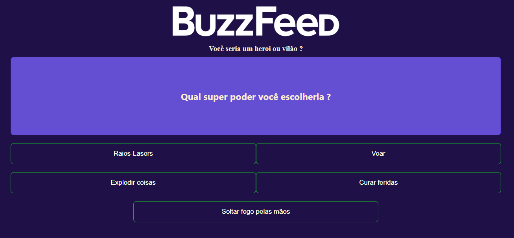

# BuzzFeed
A quiz for DIO challenge

## 📖 Sobre

A quiz created using Angular where you find out if you are a hero or villain.

## 🛠 Recursos utilizados

- HTML and CSS for the structure and design of each component.
- TypeScript for programming logic.
- Angular as a framework.

## 🖼 Visão geral

## 📁 Referências

- [DIO BuzzFeed](https://github.com/felipeAguiarCode/angular-buzzfeed-quizz-clone)
